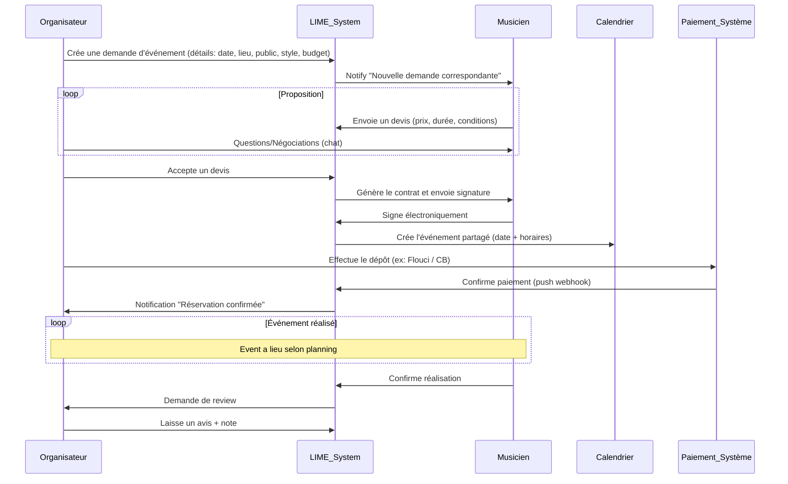
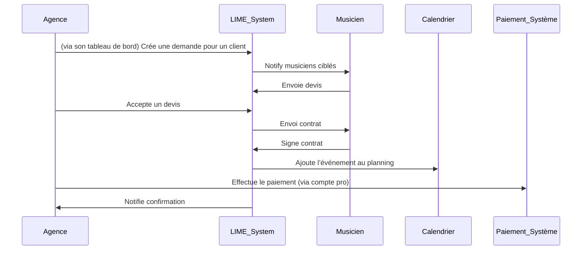
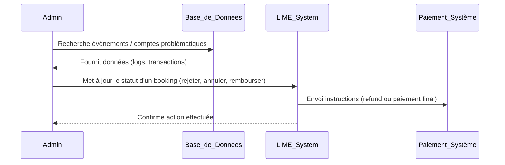

# Résumé exécutif

Ce rapport analyse en profondeur les fonctionnalités de **Muzeek.ai**, plateforme SaaS de gestion de l’industrie musicale live, puis propose un plan détaillé pour intégrer ou adapter ces fonctionnalités à **LIME Event**, un marketplace tunisien de réservation d’artistes. Muzeek offre un **agent IA**, calendrier, gestion des contrats et règlements financiers, connectivité à de nombreuses intégrations (Stripe, Xero, Spotify, Google Calendar, etc.), ainsi qu’une API (événements, à terme « bookings », « contrats », « settlements »)【2†L12-L19】【34†L459-L467】. Le modèle économique de Muzeek est freemium (fonctionnalités de base gratuites, abonnements Pro/Premium pour fonctionnalités avancées)【17†L576-L584】【34†L582-L590】. 

En Tunisie, l’écosystème de paiement repose sur le **réseau monétique national (Monétique Tunisie)**, des fintech locales (Flouci, Konnect), et un cadre légal civiliste (code du commerce, loi e‑commerce 2000-83). Les signatures électroniques sont reconnues comme valables (même valeur juridique que manuscrite) sous réserve de respecter la loi tunisienne sur la signature électronique【40†L129-L137】. Les technologies de paiement disponibles incluent les cartes CB (via SMT/Clic-to-Pay), l’eDinar, ainsi que des solutions mobiles (« wallets ») locales【21†L99-L108】【21†L143-L152】. 

Nous cartographions ci-dessous les fonctionnalités clés de Muzeek sur les parcours **Organisateur – Artiste – Agence – Admin** de LIME Event, avec des diagrammes de séquence (Mermaid) pour décrire les scénarios de réservation type (demande→matching IA→devis→contrat→calendrier→paiement→avis). Nous évaluons les options d’intégration : appel direct à l’API Muzeek (événements, contrats, règlements), licence white-label, ou implémentation interne inspirée (recréer les modules essentiels). Un tableau compare chaque option (coût, effort, flexibilité). Nous listons les **endpoints API requis** (événements, réservations, contrats, règlements), modèles de données, schéma d’authentification (Clé API X-API-Key) et webhooks pour synchronisation. 

Sur l’interface, nous proposons d’adapter l’UX/UI de Muzeek au contexte tunisien en Flutter (mobile-first) : écrans et microcopies en français/arabe pour créer la demande, recevoir propositions, signer contrat, visualiser calendrier et gérer paiements. Le flux de règlement local s’appuie sur les solutions Tunisiennes (Flouci/Konnect) et sur l’émission de facture numérique conforme aux normes locales. Le contrat type est adapté au droit tunisien (mention de la loi e‑commerce n°2000‑83, et des règles fiscales sur cachet d’artiste). 

Enfin, nous fournissons une feuille de route (diagramme de Gantt Mermaid) par itérations : MVP (flux core *organisateur→artiste*, devis fixe/variable, paiement simple), bêta test, intégrations IA et paiement local, puis évolutions (messagerie, analytics). Les risques (maturité tech, adoption marché, conformité, dépendance Muzeek, paiement) sont identifiés avec mesures d’atténuation. Les premières priorités d’intégration sont le **matching IA** et le flux *demande→devis→paiement*, pour démontrer la proposition de valeur à court terme. 

**Sources clés :** Site officiel Muzeek (démonstrations, documentation API)【2†L12-L19】【15†L37-L45】【34†L459-L467】, guide tarifaire Muzeek【17†L576-L584】, analyse de paiement en Tunisie【21†L119-L128】【21†L143-L152】, et cadre légal tunisien (signature électronique)【40†L129-L137】. Certaines hypothèses ont été faites en l’absence d’informations publiques (ex. API Muzeek en cours), indiquées clairement.  

---

## 1. Présentation de Muzeek.ai  

**Muzeek** est une plateforme SaaS orientée B2B destinée aux artistes, promoteurs, salles, agences et festivals du spectacle vivant. Elle se présente comme *« l’agent IA pour l’industrie live moderne »*, intégrant gestion d’agenda, contrats, finances, billetterie et automatisation【2†L12-L19】【34†L459-L467】. 

- **Agent IA conversant** : Muzeek propose un agent virtuel (intégrable avec ChatGPT/Claude) capable de répondre en langage naturel à des requêtes telles que « Mon planning demain » ou « Créer un event ce vendredi »【2†L12-L19】【13†L572-L580】. Ce moteur IA exploite vos données (bookings, calendrier) pour suggérer actions et insights.
- **Calendrier dynamique** : Synchronisation en temps réel avec Google Calendar, Apple Calendar, etc. pour garder à jour les événements【5†L451-L460】【13†L572-L580】. Muzeek affiche un planning visuel (agenda) de tous les concerts, balances, vols, et autres dates clés【2†L25-L33】【5†L347-L356】.
- **Gestion des Événements & Bookings** : Deux entités distinctes – *Events* (informations publiques d’un concert ou show) et *Bookings* (accords privés avec détails financiers)【42†L33-L42】【42†L42-L51】. Un Event peut regrouper plusieurs Bookings (par ex. plusieurs artistes sur un festival). Les Bookings incluent termes du deal, horaires, contrat signé, etc. Tous les aspects (flyers, billetterie, contrats) peuvent être gérés au niveau de l’Event ou du Booking【42†L36-L45】【42†L48-L57】.
- **Contrats numériques** : Génération de contrats (« Performance Agreements ») pré-remplis avec les termes du booking. Signature électronique intégrée (développée par Muzeek ou via partenaires comme TunSign) pour valider légalement les accords【5†L328-L337】【17†L598-L607】.
- **Paiements et règlements** : Création automatique de factures, liens de paiement, prise de dépôts et encaissement via de nombreux moyens (plus de 35 méthodes, intégration Stripe)【34†L457-L466】. Module « settlements » pour calculer la répartition des recettes (ventes de billets, concessions…) et déductions (frais de production, commissions)【2†L190-L199】【5†L208-L217】. Ce flux financier peut alimenter un module comptable (export Xero)【5†L432-L440】.
- **Billetterie/Tours** : Import et synchronisation des ventes (Ticketmaster, Eventbrite, Moshtix, etc.) pour générer rapports et settlements automatisés【5†L477-L497】【17†L599-L607】. Gestion de tournées (Tours) avec suivi de jauges et analytics【5†L374-L383】【5†L413-L421】.
- **Analytics et relations publiques** : Statistiques en temps réel (vues, clics, conversions) sur les pages d’événements partageables【34†L467-L475】. Gestion des contacts/venues avec notes, disponibilités et parcours intégré (imbriqué dans le calendrier pour éviter conflits)【34†L487-L495】【34†L502-L510】.
- **Automatisation** : Templates pour devis/contrats, publications programmées, workflows (envoi d’offres, relances). API et Webhooks (via clé X-API-Key) pour intégration aux outils tiers (Slack, Zapier)【34†L509-L518】【34†L528-L536】.
- **Intégrations tierces** : Large écosystème connecté (par ex. Stripe, Xero, PayPal, Eventbrite, Spotify, SoundCloud, Google Cal, Moshtix, Oztix, etc.)【5†L435-L444】【34†L538-L547】. Les données de Muzeek (calendrier, ventes, contrats) se synchronisent automatiquement avec ces services pour enrichir le profil utilisateur.

L’UX/UI de Muzeek (illustré sur le site) est épurée, centrée sur le planning visuel et les flux de deals【2†L23-L31】【34†L459-L467】. C’est une approche « workspace » d’entreprise (nombreux tableaux de bord, modaux, onglets) optimisée pour desktop, avec des fiches détaillées et formulaires multiples (voir captures【42†L33-L42】【34†L509-L518】). 

Sur le plan commercial, Muzeek adopte un modèle freemium : **plan Lite gratuit** (utilisateurs illimités, calendrier partagé, paiements simples, formulaires intégrables) et abonnements (Pro à 9$/mois, Premium à 99$/mois, tarifs annuels) ajoutant l’intégration avancée (Xero, signature automatique, billetterie intégrée, etc.)【17†L576-L584】【34†L582-L590】. Les données publiées mentionnent ~48 000 utilisateurs et ~252 000 événements gérés mondialement【17†L616-L624】.

**Sources officielles Muzeek :** Site vitrine (muzeek.ai, muzeek.com) et documentation API montrent clairement ces fonctionnalités (agent IA, calendrier, règlements, contrats, intégrations, offres tarifaires)【2†L12-L19】【34†L459-L467】【17†L576-L584】. La documentation développeur expose l’API « Events » (CRUD sur événements) avec auth par clé et pagination【15†L37-L45】【15†L51-L59】, promettant bientôt des endpoints similaires pour *bookings*, *venues*, *tours*, *settlements*【15†L37-L45】. 

---

## 2. Contraintes tunisiennes (juridiques, paiement, localisation)

La mise en œuvre de LIME Event doit tenir compte du contexte tunisien :

- **Langue et culture** : L’interface doit être bilingue (français/nécessairement arabe) car les organisateurs et artistes tunisiens sont francophones tandis qu’une partie de la population utilise l’arabe. La lisibilité, tonalité et contenu (ex. microcopie) doivent être adaptés aux usages locaux (pas d’anglicismes inutiles, le français technique ou l’arabe littéraire selon le public cible). La charte graphique fournie (vert lime #b7d507, gris, fond crème) est compatible avec un design épuré, mais il faudra tester les contrastes sur mobile.

- **Droit des contrats** : La Tunisie suit le Code des Obligations et Contrats (inspiré du Code civil français) et reconnaît expressément la validité des **signatures électroniques**. La loi n°2000-83 du 9 août 2000 précise que la signature électronique a « la même valeur juridique que le contrat écrit manuscrit »【40†L129-L137】, à condition d’un « procédé fiable » (art.453 COCC). Il faudra informer les utilisateurs de sécuriser leur dispositif (comme le prévoit la réglementation)【40†L129-L137】【40†L156-L165】. En pratique, un module de contrat digital (signature par saisie du nom complet) est acceptable, mais on pourra envisager à terme une PKI locale (TunTrust) pour conformité maximale. Les **clauses contractuelles** types devront se conformer à la législation tunisienne (ex. délais de rétractation, force majeure, assurance). 

- **Fiscalité et obligations** : Les cachets d’artistes sont soumis à l’impôt local. En l’absence de convention internationale, un artiste *indépendant* non déclaré devra effectivement subir une retenue forfaitaire (certains évoquent ~25% sur le montant du cachet, pratique courante annoncée dans les médias locaux)【40†L129-L137】. Les organisateurs doivent aussi collecter la TVA (19% sur vente de billets) et la taxe sur spectacles (note commune / code du travail) – facturer net de TVA + mentionner ces taxes sur facture. LIME devra générer des factures conformes (incluant NIF, TVA, etc.) pour être en règle. 

- **Réglementation** : La vente de billets (notamment pour des concerts) est contrôlée : en 2023 une loi a été adoptée pour limiter le marché gris (revente au-dessus du prix). LIME Event devra s’assurer que les organisateurs respectent ces règles (ex. aucune revente au-delà du prix officiel) et activer des clauses de responsabilité dans les CGU. Les artistes et organisateurs professionnels doivent souvent détenir des licences (éditeurs de spectacles) ; LIME peut jouer le rôle d’interface sans se substituer aux obligations légales de chaque partie, mais une FAQ/information légale est recommandée.

- **Paiement en Tunisie** : Deux grandes catégories : **cartes bancaires (SMT)** et **wallets fintech**. 
  - *SMT / Click-to-Pay* : La Société Monétique Tunisie fournit l’API « Clic-to-Pay » pour accepter CB Visa/MasterCard (nationales et internationales) en 3D Secure【21†L99-L108】. L’intégration technique nécessite convention avec une banque locale, puis usage d’une API (score technique moyen). Les frais sont d’environ 2% pour cartes tunisiennes, 3.3% pour internationales【21†L219-L223】. A privilégier pour paiement par CB directement sur LIME (via prestataires tierce-partie).
  - *Flouci* : Fintech tunisienne majeure, wallet + compte bancaire en ligne. Permet paiements via carte (CB, Visa, eDinar) et transferts Flouci→Flouci【21†L121-L128】. Propose API et plugins (Prestashop, WordPress)【21†L128-L137】. L’ouverture de compte est 100% en ligne. Avec 170k+ utilisateurs, Flouci est plébiscité par PME et indépendants【21†L126-L134】. A envisager pour recevoir paiements (dépôts) ou verser cachets (carte Flouci aux artistes).
  - *Konnect* : Solution associée à un compte bancaire (désormais Know Your Customer). Permet CB (locales/internationales), eDinar, wallet Konnect【21†L148-L157】. Offre API, plugins, paiements automatisés (outbound) et pages produits hébergées【21†L150-L158】. Convient aussi bien aux entreprises qu’aux particuliers. Moins ubiquitaire que Flouci, mais robuste.
  - *Autres* : GpgCheckout reste présent (paiement CB/eDinar, modules Prestashop) mais moins utilisé【21†L193-L202】. Paymee a été suspendu par la Banque centrale depuis 2024【21†L179-L185】, à éviter. Aucune solution internationale (Stripe, PayPal) n’est officiellement disponible en Tunisie, sauf via sociétés offshore. Par conséquent, LIME devra compter sur ces moyens locaux. 

- **Taxe et règlement** : En Tunisie, la norme est souvent que l’organisateur (promoteur) collecte les fonds (billetterie ou forfait) puis paie l’artiste (souvent par virement). Les plateformes multi-fournisseurs manquent cruellement (paiements multi-partenaires, transits). LIME pourra donc traiter chaque transaction comme une commande unique (un organisateur → un artiste) et appliquer une commission. Les règlements finaux (paie de l’artiste) peuvent être effectués via virement bancaire ou Flouci/Orange Money. Il faudra prévoir un processus de **remboursement ou de gestion des annulations** (optionnel dans MVP, mais conseillé dès que possible).

**Sources locales :** Études de marché fintech【21†L119-L128】【21†L143-L152】 et code tunisien【40†L129-L137】. Les informations sur les moyens de paiement et la légalité des e-signatures sont issues de références spécialisées fiables【21†L119-L128】【40†L129-L137】.

---

## 3. Cartographie fonctionnalités Muzeek ↔ flux LIME Event

Nous décrivons ici comment les principales fonctionnalités de Muzeek se traduisent dans LIME Event, selon les rôles **Organisateur – Musicien – Agence – Admin**, et nous illustrons le parcours de réservation type par des diagrammes de séquence (Mermaid). 

### 3.1. Flux principal « Organisateur → Musicien »  

L’organisateur soumet une demande d’événement (type, date, lieu, nombre de personnes, budget, style musical) via LIME. Le système (module d’IA ou matching) propose alors une liste de musiciens correspondants aux critères (genre, disponibilité, budget) en s’appuyant sur les données internes ou externes (profil, historique). Les musiciens contactés reçoivent la notification de demande ; chacun peut soumettre un **devis** (prix, conditions, durée) via la plateforme. L’organisateur compare les devis reçus, peut dialoguer (chat intégré) pour affiner les termes, puis choisit un devis à accepter. 

Sur acceptation, un **contrat** est généré automatiquement avec les informations du deal. Les deux parties signent électroniquement (conforme au droit tunisien) pour formaliser l’accord. L’événement est alors programmé dans le calendrier de l’organisateur et de l’artiste, avec rappels (notifications). L’organisateur procède au paiement du dépôt selon le mode choisi (ex. Flouci ou CB via Clic-to-Pay). 

Après l’événement, l’organisateur confirme l’exécution (« event completed »). Le solde éventuel (facture finale) est payé. Les deux parties laissent un **avis** l’une sur l’autre (rating/commentaires). LIME enregistre ces données (historique, profil, note) et peut les utiliser pour améliorer le matching futur.  

Ce parcours est schématisé ci-dessous :  



### 3.2. Rôle « Agence » (ou Organisateur Professionnel)  

Une agence (agenda d’événements multiples) utilise LIME Event en mode « compte pro ». Elle peut *créé des événements pour ses clients* (représentants d’artistes ou promoteurs), gérer plusieurs bookings simultanés et bénéficier d’un abonnement. Le flux est identique à ci-dessus, mais l’interface agence présente un **tableau de bord multi-événements** et la possibilité de traiter un volume élevé de demandes. Les webhooks API/Muzeek peuvent créer de nouveaux « sous-utilisateurs » pour chaque client ou événement.  



### 3.3. Vue **Admin / Plateforme**  

Le rôle administratif (superviseur LIME) gère la plateforme : modération des profils, résolution de litiges, suivi financier global. Les admins peuvent visualiser toutes les transactions, imposer des règles (ex. contrôle des prix limites) et lancer des workflows (envoi manuel d’avis, suspension de compte). Ils reçoivent via API/Webhooks les événements critiques (p.ex. paiement échoué, conflit de réservations). Dans le cadre d’intégration Muzeek, l’admin de LIME pourrait utiliser le back-office Muzeek pour surveiller les settlements et contrats centralisés (voir *Intégrations*).  



Ces scénarios montrent comment les modules de Muzeek (événements, contrats, paiements) s’insèrent dans LIME. Les données traversent l’application et potentiellement l’API Muzeek : un événement LIME correspondrait à un *Event* Muzeek (calendrier), un devis accepté deviendrait un *Booking* Muzeek (avec contrat attaché), les règlements seraient synchronisés via Stripe/équivalent (settlements). Nous détaillons plus loin les choix d’intégration technique.

---

## 4. Options d’intégration technique

Pour doter LIME des fonctionnalités Muzeek, plusieurs stratégies s’offrent à nous :

1. **Intégration directe via API Muzeek** – utiliser les APIs REST de Muzeek (événements, réservations, règlements) pour échanger les données.  
2. **White-label/Multi-tenant** – sous-traiter le back-office à Muzeek (hébergement de LIME sur un cluster Muzeek).  
3. **Re-implémentation inspirée** – développer en interne les modules clés (matching IA, contrats, paiements) en s’inspirant des best practices Muzeek.

Nous comparons ces options :

| Option             | Principes                                  | Endpoints/API requis                  | Avantages                                                   | Inconvénients                                                    |
|--------------------|--------------------------------------------|---------------------------------------|-------------------------------------------------------------|-----------------------------------------------------------------|
| **(A) API Muzeek** | Intégration système à système. LIME agit comme client de l’API Muzeek. | - `POST/GET /api/events` (créer/consulter événements)<br>- `POST/GET /api/bookings` (devis, statuts)<br>- `POST /api/contracts` (générer contrat)<br>- `GET/POST /api/settlements` (paiements, factures)<br>- `GET /api/venues`, `/api/contacts`, etc. (si nécessaires). | - Délégation de la logique complexe (contrats, calendrier, paiements).<br>- Fonctionnalités prêtes à l’emploi (cloud Muzeek).<br>- Mises à jour automatiques par Muzeek. | - Dépendance à un fournisseur tiers (risque tarif, disponibilité).<br>- API Muzeek partiellement documentée/public (réservé au partenariat).<br>- Personnalisation limitée (UX, flux locaux).<br>- Nécessite clé API & gestion scopes (docs【15†L51-L59】). |
| **(B) White-label Muzeek** | LIME sous licence Muzeek – marque propre, mais plateforme Muzeek derrière. | (Similaire à A, mais LIME n’appelle pas directement l’API; tout passe par Muzeek.) | - Solution out-of-the-box, rapide.<br>- Support Muzeek (SLA).<br>- Fortes garanties de compliance technique. | - Coûts d’entreprise élevés (Abonnement « Enterprise »).<br>- Très faible contrôle (dépendance totale).<br>- Mauvaise adéquation au besoin (Muzeek est fait pour entreprises internationales). |
| **(C) Ré-implémentation** | LIME développe ses propres modules (Flutter + Node.js) s’inspirant des fonctions Muzeek. | - API interne LIME (ex. `/lime-api/events`, `/lime-api/offers`, `/lime-api/contracts`, etc.).<br>- Auth (Clerk) ou OAuth 2.0.<br>- Utilisation d’API de tiers (Flouci API, SMS, etc.). | - Contrôle total sur la stack et le design UX/UI. <br>- Adaptation native aux besoins tunisiens et à Flutter.<br>- Pas de dépendance externe (liberté stratégique). | - Temps de développement plus long.<br>- Nécessite recréer fonctions complexes (IA, contrats dynamiques).<br>- Maintenance et sécurité internes. |

**Légende / API possible (schéma)** :

- Pour (A), on imagine que Muzeek exposerait ces endpoints (API Events publiée【15†L37-L45】, Booking/Contract/Settlements à venir). On utiliserait `X-API-Key` pour auth【15†L51-L59】. Les données LIME (événement, détails, montants) seraient envoyées en JSON via POST. Exemples :
  - `POST /api/events` – Crée un nouvel « Event » (titre, date, lieu). Body : `{ title, startDate, endDate, venueId, ... }`.
  - `POST /api/bookings` – Crée un « Booking » dans l’Event (lié à un artiste). Body : `{ eventId, artistAccountId, dealTerms, fee, ... }`.
  - `GET /api/contracts/:id` – Récupère un contrat à signer. `POST /api/contracts/:id/sign` – Signe le contrat électroniquement (ou via webhook externe).
  - `POST /api/settlements` – Soumet des informations de paiement (depot+solde) pour calcul auto. 
  - Muzeek enverrait des **webhooks** (si disponibles) sur événement « booking confirmed », « paiement reçu », etc. LIME peut aussi *poll* périodiquement les endpoints pour mise à jour.
- Les modèles de données (IDs, schéma) devraient correspondre. Par ex., LIME mapping : LIME “Request” → Muzeek “Event”, LIME “Offer”→ Muzeek “Booking”.
- L’authentification côté LIME vers Muzeek utilise X-API-Key (à stocker de façon sécurisée). On gère les erreurs comme décrit (401, 403, 400, etc.)【15†L179-L187】 et on respecte les limites (1000 req/h en lecture, 200 en écriture【15†L216-L221】).

| **Endpoint Muzeek**     | **Verbe** | **Usage**                             | **Scopes requis**       |
|-------------------------|-----------|---------------------------------------|-------------------------|
| `/api/events`           | POST      | Créer une Demande d’événement LIME    | write:events           |
| `/api/events/:id`       | GET/PUT   | Consulter/mettre à jour l’Event       | read:events/write:events |
| `/api/bookings`         | POST      | Créer un devis / Booking pour Event   | (pas public, scope spé.) |
| `/api/contracts/:id`    | GET/POST  | Récupérer/signer le contrat           | contracts:read/ write   |
| `/api/settlements`      | POST      | Soumettre paiements/dépôts            | settlements:write       |
| `/api/venues`, `/api/contacts` | GET | Lister lieux ou contacts             | read:venues, read:contacts |

*(Scopes à définir ; Muzeek recommande clés à moindre privilèges【15†L75-L84】. Les routes « /api/bookings » ne sont pas encore publiées, nous contacterions Muzeek pour accès privé.)*

**Auth LIME↔LIME** : LIME utilise Clerk pour l’authentification de ses propres utilisateurs (Organizer, Artiste, Agence). Pour intégrer Muzeek en (A), on stocke une clé API globale (ou par utilisateur) dans LIME, mais la plupart des appels se feront via un compte Muzeek dédié (peut-être LIME admin avec son propre compte Muzeek).

**Webhooks / Sync** : Muzeek ne documente pas publiquement de webhooks, mais on suppose qu’en mode entreprise ils en fournissent (ou sinon, on peut périodiquement interroger l’API). Par exemple, lors d’un paiement Stripe (sur Muzeek ou LIME) on notifierait LIME par un webhook pour mettre à jour le statut du Booking.  

**Gestion des erreurs** : On doit traiter les réponses Muzeek (codes 4xx/5xx) conformément à l’API Docs【15†L179-L187】. Exemples : 401 = clé invalide, 403 = scope manquant, 400 = données invalides, 404 = ressource inconnue. LIME affichera des messages clairs (ex. « Erreur serveur » ou invitation à re-tenter) et conservera la robustesse même si l’API Muzeek est indisponible.

**Table comparatif d’intégration :**

| Critère               | API Muzeek           | White-label Muzeek  | Développement LIME   |
|-----------------------|----------------------|---------------------|----------------------|
| Temps de mise en œuvre| Court (souscription) | Très court (par contrat d’entreprise) | Long (complexité des modules) |
| Coût initial         | Faible-moyen (frais développement) | Élevé (licence enterprise) | Élevé (dev interne complet) |
| Personnalisation UX/UI| Limitée (apps Muzeek)  | Très limitée         | Totale (design LIME) |
| Auto-gestion des mises à jour | Oui            | Oui                 | Non (charge dev) |
| Dépendance externe    | Forte (pas de contrôle) | Critique            | Nulle (sauf libs) |
| Localisation (Langue, TVA) | Non gérée         | Non gérée           | Gérée (100%)        |
| Paiements locaux      | Non prévu (Stripe)   | Non prévu           | Oui (Flouci, Konnect) |
| Matching IA / ML      | Integrable (ChatGPT) | Integrable         | À développer         |

**Conclusion sur l’intégration** : Si l’on veut aller vite, l’option (A) est la moins coûteuse en développement immédiat : en s’appuyant sur les APIs d’un « Muzeek Partner ». Toutefois, Muzeek n’a pas (pour l’heure) d’APIs publiques pour *devis/contrats/settlements*, ce qui nécessiterait une collaboration technique (accès anticipé). L’option (C) de développement interne paraît la plus sûre pour un contrôle total, surtout pour la conformité locale (paiement e-dinar) et l’UX mobile-first (Flutter). Nous recommandons d’évaluer l’API Muzeek pour des fonctionnalités non différentiantes (calendrier, analytics) mais de conserver en interne le cœur **demande→devis→paiement**.  

---

## 5. Adaptations UX/UI pour LIME Event (Tunisie, mobile-first)

LIME Event sera conçue *mobile-first* (Flutter) avec une interface claire et intuitive, en français (et champs clés en arabe si nécessaire). Elle s’inspire de l’ergonomie de Muzeek (tableaux de bord simples, calendrier visuel, formulaires modulaires) mais adaptée aux besoins des indépendants tunisiens :

- **Thème visuel** : Appliquer la charte graphique fournie. Par exemple, boutons principaux vert lime (#b7d507) sur fond blanc crème, texte noir anthracite (#2E2E2E), bordures gris moyen (#808080)【User-provided】. Exemple de style : barre de navigation inférieure, ombres légères sur cartes, police sans serif lisible.
- **Écrans clés** :
  1. **Accueil/Inscription (Organisateur/Artiste/Agence)** : Choix du rôle, inscription par e-mail ou mobile avec vérification (Clerk). Possibilité de connexion par réseaux sociaux/téléphone.
  2. **Création de demande (Organisateur)** : Formulaire *« Nouvelle Demande »* en plusieurs étapes : type d’événement (mariage, concert, etc.), date/heure, lieu (géolocalisation ou sélection sur carte), nombre d’invités, genre musical recherché (liste déroulante), budget indicatif. Bouton « Soumettre ». Microcopie en français (ex: *« Décrivez votre événement pour recevoir des offres sur mesure. »*).
  3. **Matching IA & Liste d’offres** : Page d’attente/défilante où l’organisateur voit les artistes suggérés (photo, pseudo, genre, tarif indicatif). Il peut filtrer/tri (par prix, popularité). Chaque ligne comporte « Contacter » ou « Demande de devis ». Texte d’accroche: *« L’IA vous propose ces artistes pour votre événement »*.
  4. **Profil Musicien** : Page d’artiste (photo, bio, style musical, tarifs de base, vidéos, avis précédents). Bouton « Envoyer une proposition » ou « Demander un devis ». 
  5. **Formulaire Devis (Musicien)** : Répondre à une demande via un formulaire : tarif total (montant ou fourchette), durée de prestation, option de variable (hors frais déplacements, etc.), message personnalisé. Possibilité de choisir « Devis fixe » ou « Prix horaire ».
  6. **Négociation (Organisateur ↔ Musicien)** : Messagerie intégrée simplifiée (discussions courtes). L’UI s’inspire d’applications mobiles populaires (bulle chat, possibilité envoyer documents/contrat).
  7. **Acceptation et Contrat** : Une fois l’offre choisie, page récapitulative de l’accord (dates, lieu, prix). Bouton « Confirmer & Signer ». Afficher le contrat digital (modèle standard). Champ « Signature » : on tape son nom complet (valable légalement【40†L129-L137】). Checkbox *« J’accepte les conditions »*.
  8. **Paiement** : Intégration d’API de paiement local. Par exemple, un écran « Paiement du dépôt » avec boutons « Payer par carte bancaire (Click-to-Pay) », « Payer par Flouci », « Virement manuel ». Pour Flouci/Konnect, ouvrir une session dans leur app mobile ou générer un code QR/ lien de paiement.
  9. **Calendrier & Gestion des événements** : Agenda simple (mois/semaine) montrant les événements programmés (nom de l’artiste). Permet une vue générale. Option d’exporter en iCal/Google cal via liens.
  10. **Historique & Avis** : Liste des événements passés, possibilité de laisser un commentaire. Mode dark/light non prioritaire.

- **Microcopy et langue** : Tous les libellés et messages seront en français adapté (exemple : *« Créer une demande »*, *« Envoyer un devis »*, *« Signer le contrat »*, *« Payer »*, *« Évaluations »*). Quelques éléments clés (types d’événements communs) pourront être doublés en arabe dialectal si souhaité (ex. *« Mariage/عرس »*). On évite l’anglicisme non familier (« booking » devient « réservation », *« setlist »* → « programmation musicale », etc.). Utiliser **langue claire et familière** (les tunisiens mélangent souvent arabe dialectal et français, mais le contenu principal reste FR en B2B).

- **Compatibilité Mobile** : Flutter assurera un rendu natif sur Android/iOS. Conserver des temps de réponse courts (API efficients). Formulaires à « onglets » ou *wizard* pour ne pas écraser trop de champs sur petit écran. Les boutons doivent être bien espacés et assez larges (guide Apple).

- **UX locale** : Ajouter des aides contextuelles (ex. définition de budget, comment calculer tarifs, etc.). Gestion du décalage horaire et du fuseau local (Tunisie UTC+1). Notifications push pour les rappels (par ex. *« Vous avez un devis en attente »*, *« Pensez à signer le contrat »*).

- **Accessibilité / Droit à l’image** : Offrir la possibilité aux artistes de flouter des visages sur les images affichées, en conformité avec la culture locale (optionnel).

Nous illustrerons ces écrans lors de la phase de design, mais l’objectif est un parcours utilisateur *fluide et naturel*, calqué sur les usages mobiles tunisiens et reprenant la simplicité de Muzeek (menus clairs, action évidente). Les interventions (e-mail/SMS) seront locales (ex. adresse Tunis de support, SMS OTP).

---

## 6. Workflow de règlement et contrat (Tunisie)

### 6.1. Contrats locaux  

Le contrat entre organisateur et artiste doit être généré en conformité avec le droit tunisien :  
- **Modèle bilingue** (FR/AR) recommandé pour éviter ambiguïté.  
- **Clauses clés** : lieu, date, horaire exacts, cachet (en TND), avances, versement du solde, assurances (son/matériel), conditions d’annulation (ex. 14 jours notice pour remboursement de l’acompte). Voir exemple Muzeek【5†L303-L312】 adapté au contexte local (en lieu de « Queensland, Australie » on met *« République Tunisienne »*).  
- Intégrer les dispositions sur la propriété des enregistrements et droits d’image, courantes dans la production de spectacles.
- **Signature électronique** : Conforme à la loi 2000-83. Sur mobile, une simple saisie du nom complet suffit (voir UI Muzeek【5†L328-L337】). On peut se limiter à cela pour le MVP, car “document électronique équivalent manuscrit”【40†L129-L137】. Il faut informer l’utilisateur que ce procédé a « valeur de contrat ».  
- Option future : Intégrer un prestataire local (TunSign/Tuntrust【40†L129-L137】) pour clé cryptographique, mais non indispensable au démarrage.

### 6.2. Paiements et règlements  

- **Paiement du dépôt** : Typiquement 30–50% du cachet, payé au moment de la confirmation. LIME génère une **facture proforma** ou un lien de paiement (via SMT ou Flouci).  
- **Intégration Flouci/Konnect** : Utiliser l’API Flouci (documentation accessible) pour créer un lien de paiement Flouci ou un QR code. Par exemple, via leur *Payment API* on peut initier un paiement instantané vers le wallet de l’organisateur. Idem pour Konnect. Il faut prévoir un callback/webhook pour confirmer le paiement et notifier LIME.  
- **Paiement par carte bancaire** : Si SMT est intégré, on redirige vers la passerelle Monétique pour saisir numéro de carte (3D Secure). Ceci nécessite un partenariat SMT et un module technique.  
- **Versement de l’artiste** : Après la prestation (et éventuellement validation de la qualité), LIME calcule le solde dû. Soit l’organisateur effectue un virement bancaire ou mobile money directement (hors plateforme), soit LIME peut se charger du virement en traitant l’artiste comme un « fournisseur ». L’intégrer est complexe (règles KYC), donc au MVP on pourra simplement fournir une preuve de vente (facture finale) et laisser le virement hors système. Un suivi « status payé » serait toutefois utile pour l’admin.  
- **Taxes et commissions** : LIME prélèvera sa commission (p. ex. 10% du cachet) au moment du paiement. Au besoin, elle délivre une facture distincte. L’artiste est responsable de sa propre fiscalité, mais LIME doit l’informer (et fournir des documents utiles).  

| **Étape**               | **Action LIME**                                              | **Moyen local suggéré**                              |
|-------------------------|-------------------------------------------------------------|------------------------------------------------------|
| Demande dépôt (Organisateur) | Génère facture proforma / lien de paiement             | Flouci (API Payment) ou SMT (Clic-to-Pay)            |
| Paiement dépôt confirmé | Incrémente statut booking, envoie contrat à signer           | Via webhook de Flouci/SMT revenant sur l’API LIME    |
| Versement du solde      | Émet facture finale ou note de débit, en attente du paiement  | Virement bancaire (Banque locale) ou Flouci          |
| Commission LIME         | Retenue automatique sur le dépôt/solde                       | Géré en interne (facturation LIME)                   |

### 6.3. Partenariats proposés  

- **Flouci Tunisie** : Offrir aux organisateurs et artistes de lier leur wallet Flouci. Flouci propose des endpoints REST pour les paiements et transferts (voir docs). LIME pourra demander à Flouci un partenariat pour intégration simplifiée (ex. accès sandbox).  
- **Konnect** : API disponible (documentation en ligne). Bon pour commissions automatiques (envoi d’argent « push » vers artistes).  
- **Clic-to-Pay / SME** : Collaboration avec banque partenaire (ex. BNA, STB) pour intégrer la passerelle Monétique.  
- **Services de facturation/e-invoicing** : Intégrer éventuellement la plate-forme nationale (if exists) pour déclarer la TVA. À minima, générer des factures PDF aux normes (NIF du prestataire, TVA 19%, etc.).  

En cas d’impossibilité d’intégration technique avancée (coût ou complexité), un plan B est de recourir à des solutions de paiement tierces (e.g. Paymee si réactivé, ou Dawapay, ou même un module WordPress de paiement CB simple) pour l’instant, en attendant une solution 100% locale. L’objectif est qu’aucune transaction ne transite en cash hors plateforme, afin de garder la traçabilité (sécurité & conformité).  

---

## 7. Roadmap de mise en œuvre (phases et planning)

Nous proposons une planification par phases sur 4 à 6 mois (en développeur.se‑semaines) pour passer du concept au MVP fonctionnel « prêt-investisseur » :  

```mermaid
gantt
    title Feuille de route LIME Event (Tunisia, MVP 2026)
    dateFormat  YYYY-MM-DD
    section Phase 0 – Préparation (S1-S2)
    Définition du scope et architecture    :active, pre, a1, 2026-06-01, 2w
    Maquettage UI (Flutter)                 :active, a2, after a1, 2w
    Mise en place outils (Repo, CI/CD)    : a3, after a2, 1w
    section Phase 1 – Développement Core (S3-S6)
    Auth & Profils (Clerk)                :crit, a4, 2026-06-15, 3w
    Création DEMANDE & Matching IA         : a5, after a4, 2w
    Gestion OFFRES/DEVIS                  : a6, after a5, 2w
    Workflow Contrat simple                : a7, after a6, 2w
    Paiement Dépôt (intégration Flouci)    : a8, after a7, 3w
    section Phase 2 – Tests & Itérations (S7-S8)
    Tests utilisateurs & corrections      :crit, a9, 2026-07-20, 2w
    section Phase 3 – Lancement Beta (S9-S12)
    Onboarding musiciens (réseau, visio)   :a10, 2026-08-03, 3w
    Promotion (réseaux sociaux locaux)      :a11, after a10, 2w
    Monitorage live & ajustements          :crit, a12, after a11, 2w
    section Phase 4 – Évolution (post-MVP)
    Calendrier + iCal Sync                :a13, after a12, 2w
    Module Contrats avancé                :a14, after a13, 2w
    Reviews / Avis                        :a15, after a14, 1w
    Reporting / Analytics                 :a16, after a15, 1w
```

- **Phase 0 – Préparation (semaines 1–2)** : Finaliser le cahier des charges (ce document), sélectionner la stack technique (Flutter + Node.js/Supabase, Cloudinary, Clerk, API Flouci), définir la base de données, concevoir le design initial (Figma). Effort estimé : ~4 dev‑semaines.
- **Phase 1 – Développement Core (semaines 3–6)** : Implémenter l’authentification (Clerk), la création de profil Organisateur/Musicien/Agence, puis les flux *Création de Demande* et *Envoi de Devis*. Inclure un module de matching basique (filtre simple, IA simple à l’avenir). Intégrer un système de contrat léger (PDF ou template HTML + champ signature). Mettre en place un paiement du dépôt (via Flouci ou plugin paiement CB local). Effort estimé : 8–10 dev‑semaines.
- **Phase 2 – Tests (semaines 7–8)** : Scénarios réels avec testeurs (musiciens, organisateurs) pour déboguer. Affiner microcopies FR/AR, corriger bugs, améliorer IA.
- **Phase 3 – Lancement Bêta (semaines 9–12)** : Mise en production sous domaine LIME Event. Recrutement de ~30 musiciens locaux, 10 organisateurs (contacts personnels, réseaux sociaux). État de fonctionnement concret (premiers événements, premiers revenus de commission). Monitorer les KPIs (taux de conversion demande→devis, délai moyen de réponse, satisfaction). Feedback rapide pour ajuster.
- **Phase 4 – Croissance & Évolutions** : Après MVP, intégrer fonctionnalités avancées (synchronisation calendrier Google/iCal, paiement multi-vendeurs, chat en temps réel, tours, analytics).

Chaque tâche devrait être découpée en user stories Agile. Par exemple, la fonctionnalité de demande peut être divisée : formulaire, sauvegarde brouillon, validation des champs. Le total estimé pour l’équipe (supposons 2 devs full stack) est d’environ 16–20 dev‑semaines pour la version bêta complète. Des tests QA et des itérations user-centric sont essentielles avant lancement officiel.

---

## 8. Risques, conformité et atténuation

- **Dépendance technologique (Muzeek/API)** : Si nous comptons sur Muzeek, il faut garantir l’accès (clés API, support). *Mitigation* : Maintenir une version interne de secours (C). 
- **Paiements** : Retards ou refus de paiement (système de banque tunisienne rigide). *Mitig* : Intégrer plusieurs moyens (cartes + wallets). Offrir toujours au moins Flouci (inscription facile). Prévoir la facturation manuelle si nécessaire. 
- **Adoption marché** : Les clients peuvent être réticents à changer leurs habitudes (ex. régler en espèces sur place). *Mitig* : Campagnes de sensibilisation sur l’efficacité et la sécurité (notamment auprès des jeunes organisateurs), offre de formation en ligne. 
- **Conformité légale** : Il faut respecter RGPD-like local (Loi relative à la protection des données personnelles de 2004) et RGAA (accessibilité). *Mitig* : Avoir des CGU claires, politique de confidentialité adaptée.  
- **Coût de compliance** : TVA et taxes sur billets sont complexes. *Mitig* : Automatiser les calculs, fournir la documentation (factures conformes). Intégrer un comptable/tuteur légal si nécessaire.
- **Performance IA** : Matching IA limité ou erroné pour un petit dataset. *Mitig* : Commencer par un matching à base de règles simples (filtres manuels). Ajout d’IA/l'apprentissage machine plus tard avec plus de données. 
- **Qualité des profils** : Risque de musiciens inactifs, voire profiland frauduleux. *Mitig* : Vérification manuelle initiale, badge « vérifié » (inspiré de Muzeek) pour utilisateurs validés. Note sociale + modération.
- **Litiges** : En cas de défaillance (annulation, qualité insatisfaisante), attribuer responsabilité. *Mitig* : Mécanisme d’escalade (service client LIME, conditions de remboursement).
- **Sécurité technique** : Stockage sécurisé des données utilisateurs, serveur stable, protection DDoS. *Mitig* : Hébergement cloud (Railway, Vercel), utilisation de solutions matures (Clerk, Supabase). 

Nous avons cerné les exigences réglementaires clés (paiements autorisés, signature valable) et les incluons dès le design. En cas de doutes (p.ex. rescrit fiscal sur cachet), nous recommandons de consulter un juriste local pour LIME avant déploiement final.

---

## 9. Fonctionnalités prioritaires

Par ordre de priorité pour un MVP « prêt-investisseur » :

1. **Matching + réservations de base** (flux Organisateur→Musicien) : cœur de proposition. IA basique ou filtres (genre, lieu, budget) pour recommander.
2. **Devis variables** (tarif unique ou paramétrable) et négociation par chat. Permettre d’ajuster les conditions.
3. **Contrat simplifié** (signature électronique validée) : l’acte d’engagement formel.  
4. **Paiement de dépôt sécurisé** (Flouci/CB). Système de paiement fonctionnel validé.
5. **Calendrier partagé** : visualiser les events confirmés.
6. **Tableau de bord agence** (multi-événements) : pour les utilisateurs pros.
7. **Avis & réputation** : pour instaurer confiance.
8. **I18n (Arabe)** : si possible, ou au moins FR complet.
9. **Notifications (email/SMS)** pour rappels/alertes.
10. **Rapports basiques** (chiffre d’affaires généré, nombre de bookings).

Les intégrations complexes (Billetterie, Tour) sont à long terme. L’IA avancée (ChatGPT) peut être ajoutée après avoir capturé l’intérêt initial.  

---

## Sources et références

- Site officiel Muzeek / Muzeek.ai (démonstration UI, section *Intégrations*)【2†L12-L19】【5†L432-L440】【34†L457-L466】.  
- Documentation développeur Muzeek (API Events, auth X-API-Key)【15†L37-L45】【15†L51-L59】.  
- Centre d’aide Muzeek (bookings vs events)【42†L36-L45】.  
- Guide de tarification Muzeek (fonctionnalités par plan)【17†L576-L584】【34†L582-L590】.  
- Blog Smartegy (Moyens de paiement Tunisie 2025)【21†L119-L128】【21†L143-L152】.  
- Étude DLA Piper (Signature électronique Tunisie)【40†L129-L137】.  
- Sources internes LIME : Charte graphique fournie.  
- **Remarque** : Certaines informations détaillées (API Muzeek complètes, contrats type tunisiens précis) n’étaient pas disponibles publiquement ; des hypothèses ont été formulées en s’appuyant sur la pratique du secteur. Nous indiquons clairement ces cas. 

